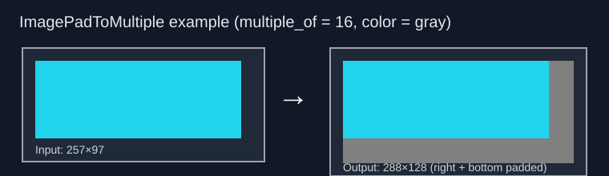

# ComfyUI Pad to Multiple

A minimal ComfyUI custom node that adds one node: `ImagePadToMultiple`.

## What it does

Pads an image by default on the **Bottom** and **Right** so both width and height are divisible by a number you pick (default `16`). You can independently select up to 2 directions (Top, Bottom, Left, Right, Left-Right, Top-Bottom) to pad. Uses a solid color for the padding. Nothing gets resized, cropped, or stretched.

Most diffusion and transformer models need input dimensions divisible by specific values, like 64 for SD 1.5 / DiT, 8 for SDXL, 16 or 32 for Flux / SD3. If your image is 513×513 it won't work as-is, and the common workarounds (stretch, crop, resize-then-crop) all silently destroy your image.

Padding is the right answer. The colored border shows you exactly where the padding is, so you can crop it off later in Photoshop, GIMP, or whatever you use.

## Why not just resize or crop?

They sound fine until they aren't:

- **Resize (stretch):** Warps everything. Faces, text, architecture all distorted.
- **Center crop:** Cuts off the edges. Your subject might be near the border. Gone.
- **Resize + crop:** Combines both problems. First warps, then chops.

The padding approach keeps your original content untouched. The padded pixels are a solid color you chose, so you can find them and remove them trivially.

## Node: `ImagePadToMultiple`

**Category:** `image/transform`

### Inputs

| Input | Type | Default | What it does |
|---|---|---|---|
| `image` | `IMAGE` | — | The image to pad |
| `multiple_of` | `INT` | `16` | Divisor target (1–256). Set to 64 for SD 1.5, 8 for SDXL, etc. |
| `pad_color` | enum | `"black"` | Padding color: `black`, `white`, or `gray` |
| `direction_1` | enum | `"Bottom"` | First padding direction. Options: Top, Bottom, Left, Right, Left-Right, Top-Bottom. |
| `direction_2` | enum | `"Right"` | Second padding direction. |

### Outputs

| Output | Type | What it is |
|---|---|---|
| `image` | `IMAGE` | Padded image tensor |
| `width` | `INT` | Width after padding |
| `height` | `INT` | Height after padding |
| `mask` | `MASK` | Mask of the padded area (1.0 = padding, 0.0 = original image) |

### How to use it

1. Plug your image into the `image` input.
2. Set `multiple_of` to whatever your model needs. 8, 16, 32, 64 — depends on the model.
3. Pick a `pad_color` that you can see against your image. Gray works for most things.
4. Run your normal pipeline.
5. After generation, crop the output back to your original size. The `width` and `height` outputs tell you the new padded dimensions so you know exactly how much to trim.

### Example



A 257×97 image padded to 272×112 with `multiple_of=16`. 15px of gray padding added on the bottom and right.

## Install

Copy into your ComfyUI custom nodes directory and restart:

```bash
cd ComfyUI/custom_nodes
git clone https://github.com/mr-september/comfyui-pad-to-multiple.git
```

Also available through the ComfyUI Manager.

## Compatibility

- ComfyUI: current stable
- Python: 3.10+
- Extra dependencies: none (just PyTorch, which you already have)

## License

MIT